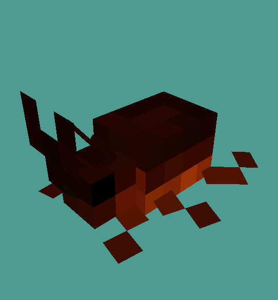

# LazDev - Simple Critter Tutorial

> [!WARNING] 
> ${\color{BurntOrange}\text{This tutorial was written for 1.20.6! If you encounter problems using a different version, you're on your own!}}$

> [!NOTE]
> This is my first tutorial, the next one will be better. If any links are broken, I'm sorry!

## Introduction

I recently regained a passion for development and have been successfully channeling creativity in microgoals. With this tutorial, I'm trying to take the next step. By writing down my process, it helps me feel real and it lets me help others. Ergo, I hope this helps you.

#### Getting on with it

___

## Tips and Tools

> [!IMPORTANT]  
> Nothing beats a primary source! Anything I don't explain well, please look up!

-  Software
   - [Blockbench](https://www.blockbench.net/)
   - [Audacity](https://www.audacityteam.org/)
   - [VS Code](https://code.visualstudio.com/) (For convenience, but you could use Notepad)
- Plugins
  - Download
    - [ModelEngine](https://mythiccraft.io/index.php?resources/model-engine%E2%80%94ultimate-entity-model-manager-1-19-4-1-21-1.1213/)
    - [MythicMMobs](https://mythiccraft.io/index.php?pages/official-mythicmobs-download/)
  - Wiki
    - [ModelEngine](https://git.lumine.io/mythiccraft/model-engine-4/-/wikis/home)
    - [MythicMobs](https://git.mythiccraft.io/mythiccraft/MythicMobs/-/wikis/home)

- Helpful Guides
  - Resource Pack Guides
    - [MC Models' Resource Pack Basics](https://mcmodels.net/guides/2-pack-basics)
    - [MC Models' Custom Sounds Guide](https://mcmodels.net/guides/4-sounds)
  - ModelEngine Guides
    - [Creating a Model](https://git.lumine.io/mythiccraft/model-engine-4/-/wikis/Modeling/Creating-a-Model#hitbox-and-eye-height)
    - [Bone Behaviours](https://git.lumine.io/mythiccraft/model-engine-4/-/wikis/Modeling/Bone-Behaviors)
    - [Animating a Model](https://git.lumine.io/mythiccraft/model-engine-4/-/wikis/Modeling/Animating-a-Model)
    - [Model Mechanics](https://git.lumine.io/mythiccraft/model-engine-4/-/wikis/MythicMobs/Model-Mechanics)
  - MythicMobs Guides
    - [Creating Your First Mob](https://git.mythiccraft.io/mythiccraft/MythicMobs/-/wikis/Guides/(Step-3)-Creating-Your-First-Mob)
    - [MythicMobs Skill Mechanics](https://git.mythiccraft.io/mythiccraft/MythicMobs/-/wikis/Skills/Mechanics)
  - Minecraft Info
    - [Sound Events](https://minecraft.fandom.com/wiki/Sounds.json#Sound_events)
 

## Step 1: Modeling and Animation

Seems like a lot for the first step? This guide assumes some knowledge of Blockbench, but there are plenty of resources on YouTube that explain the basics.

### ModelEngine Compatibility

I strongly recommend the [Creating a Model](https://git.lumine.io/mythiccraft/model-engine-4/-/wikis/Modeling/Creating-a-Model#hitbox-and-eye-height) guide to learn how to prep a Blockbench model to work with ModelEngine

There are a few traits of note that **ModelEngine** provides that make it easy to give your custom mob natural Minecraft mechanics.

___

### _Bone Behaviours_

**[ModelEngine](https://git.lumine.io/mythiccraft/model-engine-4/-/wikis/Modeling/Bone-Behaviors)** uses prefixes called ``Tags`` or specific bone IDs in the **Blockbench** model Bone 
names to apply special behaviours to the bones of your model.

There are a bunch of cool tags you can give a bone but there are a couple that are integral to pretty much every critter.

  - **hi_**
    - Ever noticed how most mobs turn their head first to look at you as their body follows behind? That's this. Importantly, the bone must contain all **head** and **neck** bones, and its pivot point has to be where you want the head to turn from (compare pig and piglin head turns).
  - **ob_**
    - Theoretically give an Oriented-Bounding hitxbox that can have  the dimensions of the critter and rotates with the parent bone. Haven't been able to make this work yet, I will update the guide once I do!
 

That's it for Bone Behaviours, the rest are beyond the scope of this guide but straightforward to use as well.

___

### _Default States_

**[ModelEngine](https://git.lumine.io/mythiccraft/model-engine-4/-/wikis/Modeling/Animating-a-Model)** uses a state machine with a list of Default States located in ``plugins/ModelEngine/config.yml``. The system automatically plays those states at appropriate times so your mob is fully covered. 

It seems like there should be a way to add new Default States but I'm not sure how. I'll update this guide if I ever learn!

Once you make your MythicMob and apply your model it, it will transfer all the default state animations and continue to play them appropriately. You may then add custom animation triggers in the MythicMobs' ``mob.yml`` if you like but that's outside the scope of this guide.

Make sure to check the default state names and name your animations accordingly.

___

Got your critter? Here's mine:

His ``idle`` animation is a wing flutter and he does a flip for his ``death`` animation.

___

### Step 2: Importing to ModelEngine

Once your model is complete you can copy it into the ``plugins/ModelEngine/blueprints`` directory and run the command ``meg reload``.

You should now be able to spawn your critter in-game using ``meg summon crittername``

Looks like a monster doesn't it?

We still need the resourcepack to skin the mob. There should be a ``resource pack.zip`` file in the ``plugins/ModelEngine`` directory, you'll want to copy that to your games' resource pack folder

Load the resourcepack and admire your little critter.

Notice its Idle animation, observe how it looks at you while walking away. Listen to it... oink?

> [!NOTE]  
> Even though you can add sound to a Blockbench model, I haven't gotten ModelEngine to recognize it, but you would think it might if it can skin and animate. I will update this guide if I find a way.

___

### Step 3: Importing to MythicMobs

Before we give our critter cute cacophonous cries, we must give it the power to scream.

Start by navigating to ``plugins/MythicMobs/mobs`` and make a file ``crittername.yml``

If you aren't familiar with making **MythicMobs** I strongly recommend checking out the [Creating Your First Mob](https://git.mythiccraft.io/mythiccraft/MythicMobs/-/wikis/Guides/(Step-3)-Creating-Your-First-Mob) guide to get started.
You can deal with that pig noise now by using the `Silent` Option.

Once you have set up your critter you can check out [Model Mechanics](https://git.lumine.io/mythiccraft/model-engine-4/-/wikis/MythicMobs/Model-Mechanics) and get a feel for what you can do with it.

Most importantly is the ``Model`` mechanic which has a bunch of properties and can, when used in the **Skills** section of your **MythicMob**, display your critter with all the same animations as when it was controlled by **ModelEngine**.

For example:
        
    Skils:
      - model{m=rhinobeetle;usm=true} @self ~onSpawn
Meaning:
  - -model is the mechanic
  - m = Your blockbench model filename 
  - usm = Use state machine?
  - @self = Apply the model to the critter
  - ~onSpawn = Apply it when the critter spawns

Obviously there are plenty of other things you could do,
the `Model` mechanic alone has over a dozen properties you could alter when using it.

Once you are satisfied with your mob configuration.
Return to the game and reload MythicMobs with ``mm reload``.
Then spawn in your critter using ``mm mobs spawn crittername``.

### Step 4: Making It scream

You might have noticed, while going through the [MythicMobs Skill Mechanics](https://git.mythiccraft.io/mythiccraft/MythicMobs/-/wikis/Skills/Mechanics) because of course you would,
that you can use Triggers to make the mob play a sound when it dies or gets hurt.
There should be a way to put it on a random interval, but at the moment I can only get ``~onTimer`` to work at regular intervals.

For example:

    Skills:
      - sound{s=entity.enderman.scream} @self ~onDeath | From MythicMobs example
      OR
      - sound{s=minecraft:custom.rhinobeetle.hiss4} @self ~onDeath  | My Rhino Beetle audio    
 
Meaning:
  - -sound is the mechanic
  - s = sound event name
  - @self = Play the sound from the critter
  - ~onDeath = Play the sound when it dies

The first example uses built-in Minecraft sound events, for which the full list can be found [HERE](https://minecraft.fandom.com/wiki/Sounds.json#Sound_events).

The second example uses a resource pack sound, which you can add by following the [Custom Sounds Guide](https://mcmodels.net/guides/4-sounds) on MC Models.

If you need critter sound effects, I recommend searching YouTube Shorts,
it worked really well for my Rhino Beetle.
Use a YouTube to Mp3 downloader and import the file into Audacity. 
Trim out what you don't need and clean the audio. 
Export selected tracks as ``.ogg`` files and put them in your resourcepack.

The sound event name is determined by the folder structure of the resourcepack.
If you followed the sound guide your folder structure should be something like ``resourcepack_name/assets/minecraft/sounds/custom``. 

You could add more folders to organize the sounds by mob/entity like I did for ``custom/rhinobeetle/hiss4.ogg``. 
Bear in mind each folder deep increases the length of the sound event name in the mechanic.

___

### Conclusion

And that's it! When you spawn your MythicMob now it will squeak and squawk how you told it to!

I'm really bored of writing this. XD

I'm sure it's only because it's taken multiple days to figure out Markdown and getting a good workflow.
This guide is complete, just lacks polish.
I will come back and tidy it later maybe, but the next will be better.

Thank you for reading!

~ lLazaran
