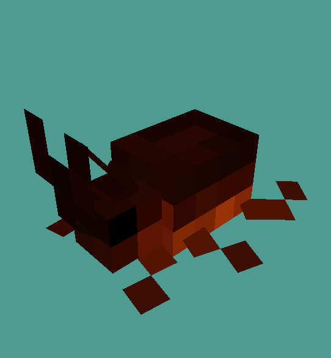

# LazDev - Simple Critter Tutorial

> [!WARNING] 
> ${\color{BurntOrange}\text{This tutorial was written for 1.20.6! If you encounter problems using a different version, you're on your own!}}$

> [!NOTE]
> This is my first tutorial, the next one will be better.

## Introduction

I recently regained a passion for development and have been successfully channeling creativity in microgoals. With this tutorial, I'm trying to take the next step. By writing down my process, it helps me feel real and it lets me help others. Ergo, I hope this helps you.

#### Getting on with it

___
## Tips and Tools
> [!IMPORTANT]  
> Nothing beats a primary source! Anything I don't explain well, please look up!

These are some resources
-  Software
   - [Blockbench](https://www.blockbench.net/)
   - [Audacity](https://www.audacityteam.org/)
   - [VS Code](https://code.visualstudio.com/) (For convenience, but you could use Notepad)
- Plugins
  - Download
    - [ModelEngine](https://mythiccraft.io/index.php?resources/model-engine%E2%80%94ultimate-entity-model-manager-1-19-4-1-21-1.1213/)
    - [MythicMMobs](https://mythiccraft.io/index.php?pages/official-mythicmobs-download/)
  - Wiki
    - [ModelEngine](https://git.lumine.io/mythiccraft/model-engine-4/-/wikis/home)
    - [MythicMobs](https://git.mythiccraft.io/mythiccraft/MythicMobs/-/wikis/home)
- Resource Pack Info
  - [MC Models' Resource Pack Basics](https://mcmodels.net/guides/2-pack-basics)
  - [MC Models' Custom Sounds Guide](https://mcmodels.net/guides/4-sounds)

 

## Step 1: Modeling and Animation

Seems like a lot for the first step? This guide assumes some knowledge of Blockbench, but there are plenty of resources on YouTube that explain the basics.

### ModelEngine Compatibility

There are a few traits of note that **ModelEngine** provides that make it easy to give your custom mob natural Minecraft behaviours.

### _Bone Behaviours_

**[ModelEngine](https://git.lumine.io/mythiccraft/model-engine-4/-/wikis/Modeling/Bone-Behaviors)** uses prefixes called ``Tags`` or specific bone IDs in the **Blockbench** model Bone 
names to apply special behaviours to the bones of your model.

There are a bunch of cool tags you can give a bone but there are a couple that are integral to pretty much every critter.

  - **hi_**
  - **ob_**
    - Theoretically give a hitbox that can be exactly the dimensions of the critter and rotates with the parent bone.

### _Default States_

**[ModelEngine](https://git.lumine.io/mythiccraft/model-engine-4/-/wikis/Modeling/Animating-a-Model)** uses a state machine with a list of Default States located in ``plugins/ModelEngine/config.yml``. The system automatically plays those states at appropriate times so your mob is fully covered. 

As far as I'm aware, there is no way to add new default states to ModelEngine directly, but that's where MythicMobs comes to the rescue.

Once you make your MythicMob and apply your model it, it will transfer all the default state animations and continue to play them appropriately. You may then add custom animation triggers in the MythicMobs' ``mob.yml`` if you like but that's outside the scope of this guide.

Make sure to check the default state names and name your animations accordingly.

Got your critter? Here's mine:

His ``idle`` animation is a wing flutter and he does a flip for his ``death`` animation.

We'll use the MythicMobs and ModelEngine plugins, along with Blockbench and Audacity, as well as a safe Youtube to MP3 converter.

We begin by modeling our creature in Blockbench, in the Generic Model project format. Give it a texture and some animations. Be sure to name the animations as per the default state names in the ModelEngine config.yml file, this way they will be automatically assigned when imported, even as a MythicMob model.

To get the mob to look then turn towards you, like a pig or villager does, you need to make a bone and give its name the prefix 'hi\_' and put all bones for the head/neck of your mob in it and place the pivot point where you want the head/neck to turn from.

Similarly, to give the mob a custom hitbox that turns with it, theoretically, you could use the prefix 'ob\_' and get a hitbox that turns with its parent bone and has discrete X and Z scales, unlike the default custom named 'hitbox' which is square with Y height.

Once the Blockbench model is complete, you just drag it into **plugins/ModelEngine/blueprints**

Either through console or in-game, reload ModelEngine with 'meg reload'

Go back to the ModelEngine folder and copy the 'resource pack.zip' that's there and paste it into your games' resourcepack folder.

'meg reload' for good measure and then summon your critter with 'meg summon filename'.

You may notice that the critter sounds like a pig, no worries, modelengine on its own is a bit limited, but MythicMobs adds a fair amount of functionality.

To start integrating, we need to make a new MythicMob (MM henceforth) by making 'crittername.yml' in **plugins/MythicMobs/mobs**

An MM can have a lot of custom parts but we're going to stick with what I used when I made my Rhino Beetle.
