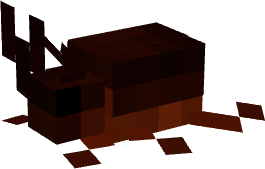

# Laz Dev - Tutorial 1
> [!WARNING] Warning: This tutorial was written using Minecraft 1.20.6, if you are using a different version, there is no gurantee any of this will work

> [!TIP] $\color{Apricot}{The\ quick\ brown\ fox\ jumps\ over\ the\ lazy\ dog.}$

Hi, Welcome to my first tutorial!
-
-
- Plugins
- Download
- Wiki
    - [ModelEngine](https://git.lumine.io/mythiccraft/model-engine-4/-/wikis/home)
    - [MythicMobs](https://git.mythiccraft.io/mythiccraft/MythicMobs/-/wikis/home)

Today, we're going to make this guy a new mob in Minecraft.

$\color{Apricot}{The\ quick\ brown\ fox\ jumps\ over\ the\ lazy\ dog.}$

>[!TIP]Wondering what to do?

> [!NOTE]  
> Highlights information that users should take into account, even when skimming.

> [!TIP]
> Optional information to help a user be more successful.

> [!IMPORTANT]  
> Crucial information necessary for users to succeed.

> [!WARNING]  
> Critical content demanding immediate user attention due to potential risks.

> [!CAUTION]
> Negative potential consequences of an action.

We'll use the MythicMobs and ModelEngine plugins, along with Blockbench and Audacity, as well as a safe Youtube to MP3 converter.

We begin by modeling our creature in Blockbench, in the Generic Model project format. Give it a texture and some animations. Be sure to name the animations as per the default state names in the ModelEngine config.yml file, this way they will be automatically assigned when imported, even as a MythicMob model.

To get the mob to look then turn towards you, like a pig or villager does, you need to make a bone and give its name the prefix 'hi\_' and put all bones for the head/neck of your mob in it and place the pivot point where you want the head/neck to turn from.

Similarly, to give the mob a custom hitbox that turns with it, theoretically, you could use the prefix 'ob\_' and get a hitbox that turns with its parent bone and has discrete X and Z scales, unlike the default custom named 'hitbox' which is square with Y height.

Once the Blockbench model is complete, you just drag it into **plugins/ModelEngine/blueprints**

Either through console or in-game, reload ModelEngine with 'meg reload'

Go back to the ModelEngine folder and copy the 'resource pack.zip' that's there and paste it into your games' resourcepack folder.

'meg reload' for good measure and then summon your critter with 'meg summon filename'.

You may notice that the critter sounds like a pig, no worries, modelengine on its own is a bit limited, but MythicMobs adds a fair amount of functionality.

To start integrating, we need to make a new MythicMob (MM henceforth) by making 'crittername.yml' in **plugins/MythicMobs/mobs**

An MM can have a lot of custom parts but we're going to stick with what I used when I made my Rhino Beetle.
